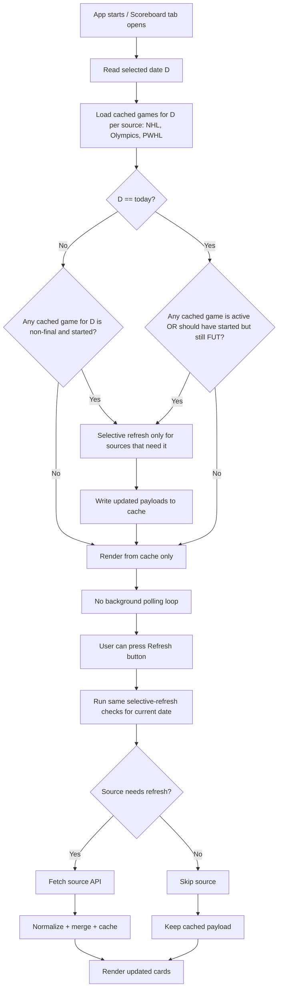

# Scoreboard Refresh Flow

## Selective-refresh criteria (per source)

- Refresh only when at least one game is either:
  - currently active (`LIVE`, `CRIT`, etc.), or
  - marked future but start time has already passed.
- Do not refresh sources whose games are all final/off.
- For non-today dates, cache-first is always used; API is only touched if cached data shows unresolved games.

